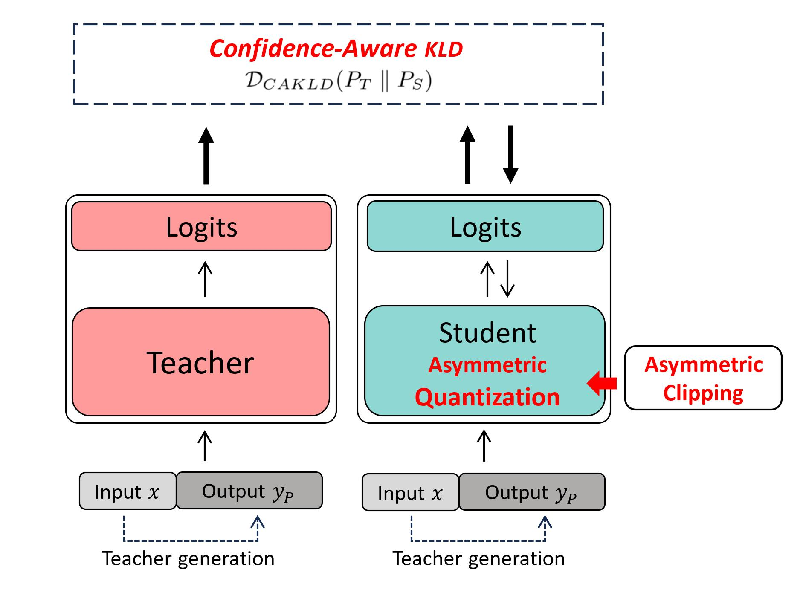
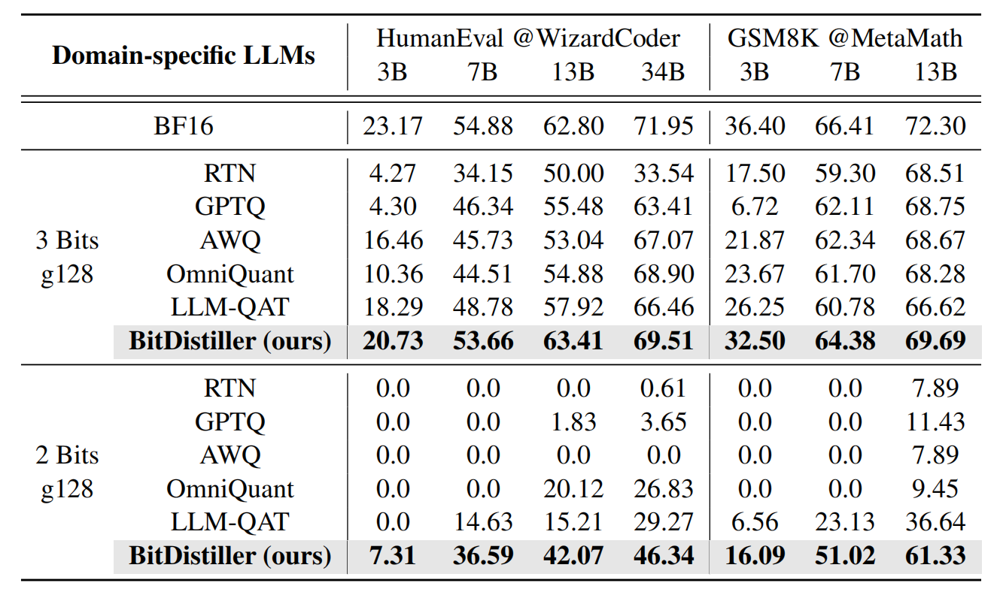
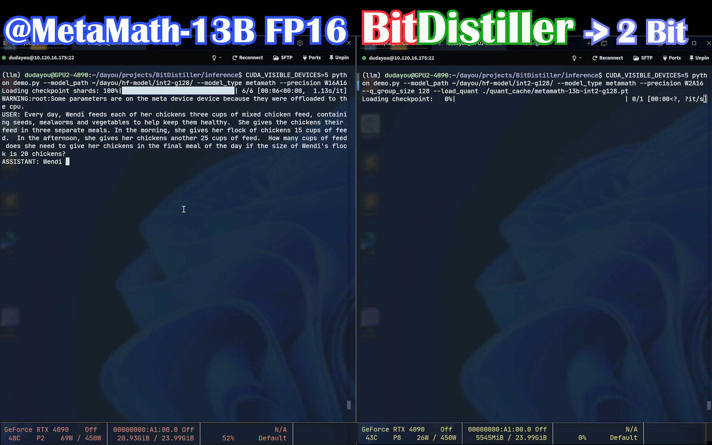

# [ACL 2024] BitDistiller: Unleashing the Potential of Sub-4-Bit LLMs via Self-Distillation [[paper]](http://arxiv.org/abs/2402.10631)

**Implementing efficient sub-4-bit weight quantization (3 / 2 bits) in LLMs through advanced QAT-based Self-Distillation techniques.**



## Comparing general language tasks with other methods

<!-- -->
## Comparing reasoning benchmarks with other methods


## Example on 2-bit inference of a Domain-specific LLM (MetaMath)


## News
* [2024/05] 🔥 BitDistiller has been accepted to ACL main 2024! 


## Contents
1. [Setup](#1-setup)
2. [Running](#2-running)
3. [Evaluation](#3-evaluation)
4. [Inferencce](#4-inference)

## 1. Setup
* python 3.9, pytorch >= 1.13
* pip install -r requirement.txt 
  
  (You may need to change the version of transformers according to the model config)

## 2. Running

Our results is running by following 3 steps:

### 2.1. Asymmetric Quantization
* Determine the type of quantization: use `nf3` for 3 bits and `int` for 2 bits. Set `w_bit` and `quant_type` accordingly.

* Perform clipping before training and save the clipping values using dump_clip (see `quantization/autoclip.py`).

>This step can match or surpass the low-bit PTQ quantization results of GPTQ and AWQ.

### 2.2. Generating Teacher Data
* For QAT, create data using the Teacher Model (BF16). The data varies depending on the model (see `data/generation`).


### 2.3. KD-base QAT
* Detailed procedure available in `train/`


### Example Srcipts

<details>
  <summary>LLaMA-2</summary>
  
1. Get the Clipping result
    ```bash
    cd BitDistiller/quantization
    ~ 8 min
    CUDA_VISIBLE_DEVICES=0 python autoclip.py --model_path ../models/TinyLlama_v1.1 --calib_dataset pile --quant_type int --w_bit 2 --q_group_size 128 --run_clip --dump_clip ./clip_cache/TinyLlama_v1.1/int2-g128.pt
    ```
2. Get the Teacher Generation Data (Using vllm would be much faster)
    ```bash
    # vllm
    python generate_vllm.py --base_model <model_path> --dataset_name wikitext --out_path ./datasets/hf-llama-2-7b/ --max_sample 3000

    python generate_vllm.py --base_model <model_path> --dataset_name alpaca --out_path ./datasets/hf-llama-2-7b/ --max_sample 5000

    # change to path in .py
    python mix_data.py
    ```

    ```bash
    # torchrun
    cd BitDistiller/data/generation
    ~ 1-2 min setup + 27s/size-16 batch
    ~ 3hr25min to generate in total, ~1hr20min wikitext, 2hr5min alpaca
    bash generate.sh ../../models/TinyLlama_v1.1 wikitext ../datasets/tinyllama_v1.1/ 16 3000

    bash generate.sh ../../models/TinyLlama_v1.1 alpaca ../datasets/tinyllama_v1.1/ 16 5000

    # change to path in .py
    python mix_data.py
    ```
3. Run KD-base QAT
    Estimate 1h 15 min per epoch which is pretty good, we could 
    actually to afford to train for 4 epochs is we wanted to, though it may be best to keep it to 1-2.
    ```bash
    # Specify the pre-trained model path
    # Specify the num_gpus and batch_size according to your GPU devices
    # Specify the clipping cache path to the --clip

    cd train
    

    bash train.sh ../data/datasets/tinyllama_v1.1/mix_wiki_alpaca_8000.json ./ckpts/tiny_llama_v1.1/int2-g128/ ./logs/tiny_llama_v1.1/int2-g128/ 4
    ```
</details>

<details>
  <summary>WizardCoder</summary>
  
1. Get the Clipping result
    ```bash
    cd BitDistiller/quantization

    CUDA_VISIBLE_DEVICES=0 python autoclip.py --model_path <model_path> --calib_dataset code --quant_type int --w_bit 2 --q_group_size 128 --run_clip --dump_clip ./clip_cache/WizardCoder-7B/int2-g128.pt
    ```
2. Get the Teacher Generation Data
    ```bash
    # vllm
    python generate_vllm.py --base_model <model_path> --dataset_name code --out_path ./datasets/WizardCoder-7b/ --max_sample 3000
    ```

    ```bash
    cd BitDistiller/data/generation

    bash generate.sh /root/WizardCoder-Python-7B/ code ../datasets/WizardCoder-7b/ 16 3000
    ```
3. Run KD-base QAT
    ```bash
    # Specify the pre-trained model path
    # Specify the num_gpus and batch_size according to your GPU devices
    # Specify the clipping cache path to the --clip

    cd train
    
    bash train.sh ../data/datasets/WizardCoder-7b/code_T0.7_N1024_S42_3000.json ./ckpts/WizardCoder-7b/int2-g128/ ./logs/WizardCoder-7b/int2-g128/ 2
    ```
</details>

<details>
  <summary>MetaMath</summary>

1. Get the Clipping result
    ```bash
    cd BitDistiller/quantization

    CUDA_VISIBLE_DEVICES=0 python autoclip.py --model_path <model_path> --calib_dataset gsm8k --quant_type int --w_bit 2 --q_group_size 128 --run_clip --dump_clip ./clip_cache/MetaMath-7B/int2-g128.pt
    ```
2. Get the Teacher Generation Data
    ```bash
    # vllm
    python generate_vllm.py --base_model <model_path> --dataset_name math --out_path ./datasets/MetaMath-7B/ --max_sample 3000
    ```

    ```bash
    cd BitDistiller/data/generation

    bash generate.sh /root/MetaMath-7B-V1.0/ math ../datasets/MetaMath-7B/ 16 3000
    ```
3. Run KD-base QAT
    ```bash
    # Specify the pre-trained model path
    # Specify the num_gpus and batch_size according to your GPU devices
    # Specify the clipping cache path to the --clip

    cd train
    
    bash train.sh ../data/datasets/MetaMath-7B/math_T0.7_N1024_S42_3000.json ./ckpts/MetaMath-7b/int2-g128/ ./logs/MetaMath-7b/int2-g128/ 2
    ```
</details>

## 3. Evaluation
### Example Srcipts
<details>
  <summary>LLaMA-2</summary>


* Test PPL on WikiText-2
Works out of the box
  ```bash
  cd test/general

  python wiki_ppl.py --model ../../train/ckpts/tiny_llama_v1.1/int2-g128/checkpoint-12/ --quant_type int --bits 2 --group_size 128
  ```
Needed to replace deprecated load_metric, 
https://discuss.huggingface.co/t/cant-import-load-metric-from-datasets/107524

* Test MMLU
  ```bash
  CUDA_VISIBLE_DEVICES=0 python llm_eval.py --model  ../../models/TinyLlama_v1.1 --eval_tasks hendrycksTest-* --test_set --bits 2 --group_size 128 --batch_size 8 --quant_type int --num_fewshot 0
  ```
To speed up MMLU (and effectively evaluate model in approximately 10 minutes) we must change num_fewshot. By reducing num_fewshot to zero, the above script takes 9:02 mins to run all requests on a NVIDIA A40 with 9 vCPU and 50 GB RAM [Note: By decreasing the batch_size to 2, the above script takes 10:01 mins to run all requests].
There are concerns to doing this though. Changing the number of fewshot examples leads to a reduction in the MMLU accuracy. For num_fewshot 5, MMLU accuracy is 26.36 [Note: the original TinyLlama paper, https://arxiv.org/pdf/2401.02385, reports MMLU accuracy of 26.58 for 5 shot testing]. However, reducing num_fewshot to 0, TinyLlama_v1.1 achieves an accuracy on MMLU of 25.12. Therefore, to stay consistent with the evaluation methodology of TinyLlama and BitDistiller we probably shouldn't change num_fewshot.

* Test Common-sense QA Tasks

hellaswag is hellaslow 10 min, 46355 iterations ~10 min
all datasets work out of the box except arc_challenge,
since it involves a subset of ai2_arc. Need to figure out
how to just get the subset.
  ```bash
  CUDA_VISIBLE_DEVICES=0 python llm_eval.py --model ../../train/ckpts/tiny_llama_v1.1/int2-g128/checkpoint-12/  --eval_tasks arc_challenge,winogrande,hellaswag,piqa --test_set --bits 2 --group_size 128 --quant_type int --num_fewshot 0 
  ```

</details>

<details>
  <summary>WizardCoder</summary>

* Install the environment according to the instructions of [HumanEval](https://github.com/openai/human-eval), 

* Example script:
    ```bash
    cd test/humaneval
    bash gen_preds.sh [checkpoint_path] ./preds/7b/int2-g128/
    ```
</details>

<details>
  <summary>MetaMath</summary>
  
* Example script:

    ```bash
    cd test/gsm8k
    bash test.sh ../../train/ckpts/MetaMath-7b/int2-g128/ ./preds/7b/int2-g128/
    ```
</details>


## 4. Inference
Please see `inference/`


## Reference
If you find BitDistiller useful or relevant to your research, please kindly cite our paper:
```
@misc{du2024bitdistiller,
      title={BitDistiller: Unleashing the Potential of Sub-4-Bit LLMs via Self-Distillation}, 
      author={Dayou Du and Yijia Zhang and Shijie Cao and Jiaqi Guo and Ting Cao and Xiaowen Chu and Ningyi Xu},
      year={2024},
      eprint={2402.10631},
      archivePrefix={arXiv},
      primaryClass={cs.CL}
}
```
